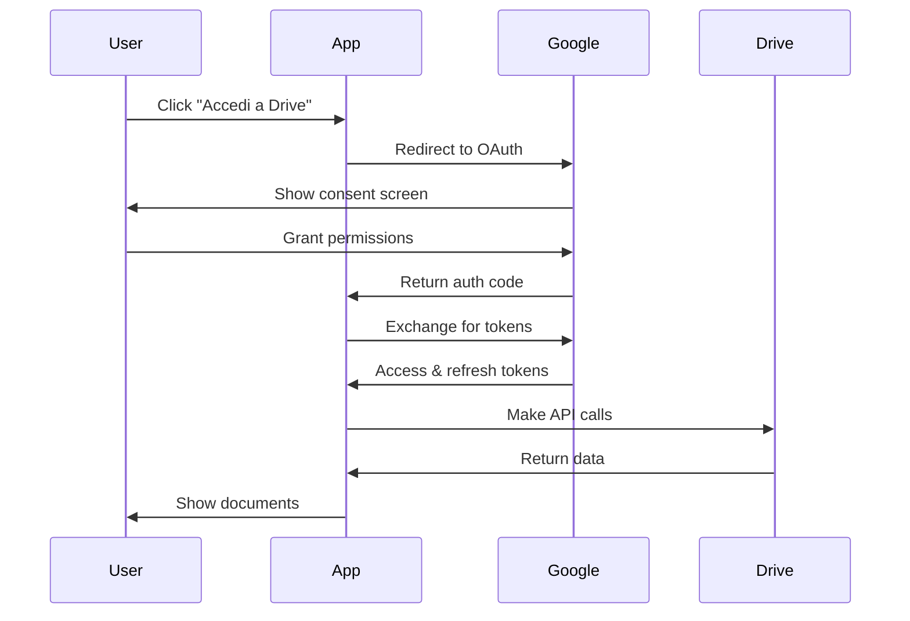

# Configurazione Google Drive API - Guida Completa

## 📋 Panoramica

La gestione documentale di LyfeUmbria Manager si integra con Google Drive per fornire:
- Archiviazione cloud sicura e affidabile
- Sincronizzazione automatica
- Accesso da qualsiasi dispositivo
- Sistema di backup integrato
- Controllo granulare dei permessi

## 🚀 Setup Iniziale

### 1. Creazione Progetto Google Cloud

1. Visita [Google Cloud Console](https://console.cloud.google.com)
2. Crea un nuovo progetto o seleziona uno esistente
3. Assicurati che il progetto sia attivo (visibile nell'header)

### 2. Abilitazione API

1. Nel menu laterale, vai su "API e Servizi" > "Libreria"
2. Cerca e abilita le seguenti API:
   - **Google Drive API**
   - **Google Sheets API** (opzionale, per future funzionalità)
   - **Google Docs API** (opzionale, per future funzionalità)

### 3. Configurazione OAuth2

1. Vai su "API e Servizi" > "Credenziali"
2. Clicca "Crea credenziali" > "ID client OAuth"
3. Seleziona "Applicazione web"
4. Configura:
   - **Nome**: "LyfeUmbria Manager"
   - **URI redirect autorizzati**:
     - `http://localhost:3000/auth/callback` (sviluppo)
     - `https://your-domain.com/auth/callback` (produzione)
5. Salva Client ID e Client Secret

### 4. Service Account (Opzionale)

Per operazioni server-side:

1. Vai su "API e Servizi" > "Credenziali"
2. Clicca "Crea credenziali" > "Account di servizio"
3. Completa la configurazione:
   - **Nome**: "lyfeumbria-drive-service"
   - **Descrizione**: "Service account per gestione documenti"
4. Scarica il file JSON delle credenziali
5. Salva il file in una posizione sicura del server

## 🔧 Configurazione Applicazione

### Variabili d'Ambiente

Crea o aggiorna il file `.env.local`:

```env
# Google OAuth2 Credentials
NEXT_PUBLIC_GOOGLE_CLIENT_ID=1234567890-abcdef.apps.googleusercontent.com
GOOGLE_CLIENT_SECRET=GOCSPX-your_client_secret_here

# Redirect URI
NEXT_PUBLIC_REDIRECT_URI=http://localhost:3000/auth/callback

# Service Account (Opzionale)
GOOGLE_SERVICE_ACCOUNT_KEY_PATH=/secure/path/service-account.json

# Cartella Google Drive (Opzionale)
GOOGLE_DRIVE_FOLDER_ID=1BxiMVs0XRA5nFMdKvBdBZjgmUUqptlbs74OgvE2upms
```

### Setup Cartella Google Drive

1. Accedi al tuo Google Drive
2. Crea una nuova cartella chiamata "LyfeUmbria Documents"
3. Copia l'ID della cartella dall'URL:
   ```
   https://drive.google.com/drive/folders/[FOLDER_ID]
   ```
4. Incolla l'ID nel file `.env.local` come `GOOGLE_DRIVE_FOLDER_ID`

## 🛡️ Sicurezza e Permessi

### Configurazione Domini Autorizzati

1. In Google Cloud Console, vai su "API e Servizi" > "Schermata consenso OAuth"
2. Configura:
   - **Tipo**: Interno (per uso aziendale) o Esterno (pubblico)
   - **Domini autorizzati**: Aggiungi i tuoi domini
   - **Ambiti**: Seleziona solo gli ambiti necessari per Drive

### Ambiti Richiesti

L'applicazione richiede i seguenti ambiti OAuth2:
```
https://www.googleapis.com/auth/drive
https://www.googleapis.com/auth/drive.file
```

### Best Practices Sicurezza

1. **Client Secret**: Mai esporre in codice frontend
2. **Token Storage**: Usa storage sicuro (httpOnly cookies)
3. **Token Refresh**: Implementa refresh automatico
4. **Scope Minimo**: Richiedi solo i permessi necessari
5. **Audit**: Monitora accessi e modifiche

## 🔄 Flusso di Autenticazione

### 1. User Authentication Flow



### 2. Token Management

- **Access Token**: Valido per 1 ora
- **Refresh Token**: Valido fino alla revoca
- **Storage**: Sicuro, httpOnly cookies
- **Refresh**: Automatico prima della scadenza

## 📁 Struttura Cartelle Consigliata

```
LyfeUmbria Documents/
├── Contratti/
│   ├── Fornitori/
│   ├── Dipendenti/
│   └── Ospiti/
├── Fatture/
│   ├── 2026/
│   ├── 2025/
│   └── Archive/
├── Certificazioni/
│   ├── Sicurezza/
│   ├── Sanitarie/
│   └── Edilizie/
├── Marketing/
│   ├── Foto/
│   ├── Brochure/
│   └── Social/
└── Amministrazione/
    ├── Bilanci/
    ├── Tasse/
    └── Registro/
```

## 🧪 Test di Configurazione

### Verifica API

1. Avvia l'applicazione: `npm run dev`
2. Naviga alla sezione "Documenti"
3. Verifica che appaia il pulsante "Accedi a Google Drive"
4. Testa il flusso di autenticazione completo

### Debug Common Issues

| Problema | Soluzione |
|----------|-----------|
| `invalid_client` | Verifica Client ID e Secret |
| `redirect_uri_mismatch` | Controlla URI autorizzati |
| `access_denied` | Utente ha negato i permessi |
| `insufficient_scope` | Aggiungi ambiti mancanti |

## 📊 Monitoraggio e Analytics

### Google Cloud Console

1. "API e Servizi" > "Dashboard" per statistiche d'uso
2. "Logging" per debug errori
3. "Monitoring" per performance metrics

### Quota e Limiti

- **Requests per day**: 1,000,000,000
- **Requests per minute**: 1,000 per user
- **Files upload**: Max 5TB per file

## 🔄 Aggiornamenti e Manutenzione

### Rotazione Credenziali

1. Genera nuove credenziali periodicamente
2. Aggiorna `.env.local`
3. Testa completamente l'integrazione
4. Elimina credenziali vecchie

### Backup e Recovery

1. Le credenziali sono salvate in Google Cloud
2. Mantieni backup sicuro del Service Account JSON
3. Documenta tutte le configurazioni

---

**⚠️ Importante**: Mai committare credenziali nei repository Git. Usa sempre variabili d'ambiente e file `.env.local` non tracciati.